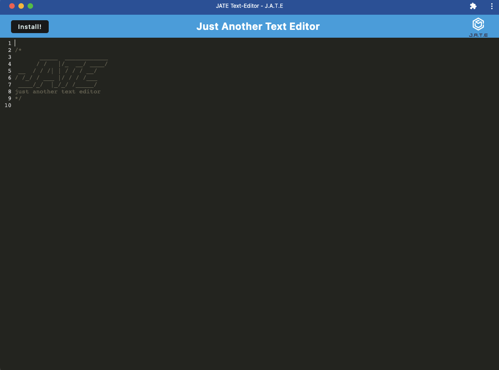

# text-editor

## Description

This PWA project is a single page text editor application that can run inside the browser or be installed locally and work offline. Application utilizes [CodeMirror](https://codemirror.net/) API for text colors. Language mode is set to JavaScript and the theme is set to Monokai. Data is stored using IndexedDB API and idb package. 

## Table of Contents

- [Installation](#Installation)
- [Usage](#Usage)
- [References](#Refrences)
- [License](#license)
- [Contributing](#Contributing)
- [Questions](#Questions)

## Installation
[Repository](https://github.com/a-donati/text-editor)

* From GitHub, fork or clone the repo. The user must have Node.js installed. Once forked, run `npm i` from the root directory to install required dependencies.
* Run `npm start` to start the application

## Usage

Type within the text fields, content is saved to IndexedDB once the user clicks outside of the focused text area

 [Click here for deployed Heroku application](https://polar-tor-58149.herokuapp.com/)
 

## References

* [IndexedDB](https://developer.mozilla.org/en-US/docs/Web/API/IndexedDB_API)
* [idb](https://www.npmjs.com/package/idb)
* [Webpack](https://www.npmjs.com/package/webpack)
* [CodeMirror](https://codemirror.net/)

## License

This application is covered under MIT License

  

    

      License Text
    
 
 
  Copyright (c) 2022 a-donati
  
  Permission is hereby granted, free of charge, to any person obtaining a copy
  of this software and associated documentation files (the "Software"), to deal
  in the Software without restriction, including without limitation the rights
  to use, copy, modify, merge, publish, distribute, sublicense, and/or sell
  copies of the Software, and to permit persons to whom the Software is
  furnished to do so, subject to the following conditions:
        
  The above copyright notice and this permission notice shall be included in all
  copies or substantial portions of the Software.
        
  THE SOFTWARE IS PROVIDED "AS IS", WITHOUT WARRANTY OF ANY KIND, EXPRESS OR
  IMPLIED, INCLUDING BUT NOT LIMITED TO THE WARRANTIES OF MERCHANTABILITY,
  FITNESS FOR A PARTICULAR PURPOSE AND NONINFRINGEMENT. IN NO EVENT SHALL THE
  AUTHORS OR COPYRIGHT HOLDERS BE LIABLE FOR ANY CLAIM, DAMAGES OR OTHER
  LIABILITY, WHETHER IN AN ACTION OF CONTRACT, TORT OR OTHERWISE, ARISING FROM,
  OUT OF OR IN CONNECTION WITH THE SOFTWARE OR THE USE OR OTHER DEALINGS IN THE
  SOFTWARE.

  

## Contributing

Please contact me to be added as a collaborator to this project.
